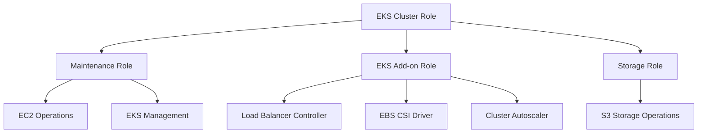

# AWS BYOC-I EKS Module - IAM Roles Documentation

This document describes the four IAM roles created by the AWS BYOC-I EKS module and their specific purposes in the Zilliz Cloud infrastructure.

## Overview

The AWS BYOC-I EKS module creates four distinct IAM roles, each designed for specific operational responsibilities within the Zilliz Cloud BYOC (Bring Your Own Cloud) environment. These roles follow the principle of least privilege and are scoped to specific AWS services and operations.

## IAM Roles Summary

| Role Name | Purpose | Principal Services | Key Operations |
|-----------|---------|-------------------|----------------|
| **EKS Cluster Role** | Combined EKS cluster and node management (based on [AWS EKS cluster role](https://docs.aws.amazon.com/eks/latest/userguide/cluster-iam-role.html) and [AWS EKS node role](https://docs.aws.amazon.com/eks/latest/userguide/create-node-role.html)) | `eks.amazonaws.com`, `eks-nodegroup.amazonaws.com`, `ec2.amazonaws.com` | EKS cluster operations, node group management, ECR access, assume to maintenance role for initialization |
| **EKS Add-on Role** | AWS Load Balancer Controller, EBS CSI Driver, Cluster Autoscaler | OIDC Federation (kube-system service accounts) | Load balancer management, volume operations, auto-scaling |
| **Maintenance Role** | EKS cluster and node group version upgrades, cluster administration (tag-restricted scope) | OIDC Federation (infra agent), EKS Cluster Role | Node group management, EC2 operations, version upgrades, allow EKS role to assume |
| **Storage Role** | S3 bucket access for Milvus, index-pool, and Loki | OIDC Federation (Milvus, Loki, index-pool) | S3 object read/write for Milvus, index-pool, and Loki  |

## Role Dependencies

## Detailed IAM Roles

### 1. EKS Cluster Role (`eks_role`)

**Purpose**: Combined EKS cluster and node management (merges AWS EKS cluster role and node role into a single role)

**Principal Services**:
- `eks.amazonaws.com` - EKS cluster service
- `eks-nodegroup.amazonaws.com` - EKS node group service  
- `ec2.amazonaws.com` - EC2 instances for worker nodes

**Key Permissions**:
- Amazon EKS Cluster Policy (AWS Managed)
- Amazon EKS Worker Node Policy (AWS Managed)
- Amazon EKS CNI Policy (AWS Managed)
- Amazon EKS VPC Resource Controller (AWS Managed)
- Amazon EC2 Container Registry Read Only (AWS Managed)
- Ability to assume the maintenance role for initialization tasks

**Use Cases**:
- EKS cluster creation and management
- Node group operations
- Container image pulling from ECR
- Assume to maintenance role for initialization tasks (CNI installation and agent deployment)

> **Reference**: This role combines functionality from both [Amazon EKS cluster IAM role](https://docs.aws.amazon.com/eks/latest/userguide/cluster-iam-role.html) and [Amazon EKS node IAM role](https://docs.aws.amazon.com/eks/latest/userguide/create-node-role.html) into a single unified role for simplified management.

### 2. EKS Add-on Role (`eks_addon_role`)

**Purpose**: AWS Load Balancer Controller, EBS CSI Driver, and Cluster Autoscaler operations

**Principal Services**:
- OIDC Federation for Kubernetes service accounts:
  - `system:serviceaccount:kube-system:aws-load-balancer-controller`
  - `system:serviceaccount:kube-system:ebs-csi-controller-sa`
  - `system:serviceaccount:kube-system:cluster-autoscaler`

**Key Permissions**:
- **AWS Load Balancer Controller**:
  - Create, modify, and delete load balancers and target groups
  - Manage security groups for load balancers
  - Handle SSL certificates and listeners
  - Tag resources with cluster identification

- **EBS CSI Driver**:
  - Create, attach, detach, and delete EBS volumes
  - Create and manage EBS snapshots
  - Tag volumes with cluster identification
  - Enable fast snapshot restores

- **Cluster Autoscaler**:
  - Describe Auto Scaling groups and instances
  - Modify desired capacity of Auto Scaling groups
  - Terminate instances in Auto Scaling groups
  - Describe EKS node groups and instance types

**Use Cases**:
- Dynamic load balancer provisioning for Kubernetes services
- Persistent volume management for stateful workloads
- Automatic cluster scaling based on resource demands

### 3. Maintenance Role (`maintenance_role`)

**Purpose**: EKS cluster and node group version upgrades, cluster administration, and infrastructure operations (tag-restricted scope)

**Principal Services**:
- OIDC Federation for Zilliz infrastructure agent:
  - `system:serviceaccount:infra:infra-agent-sa`
- EKS Cluster Role (with external ID validation)

**Key Permissions**:
- **EKS Management** (tag-restricted to `Vendor=zilliz-byoc`):
  - Create, update, and delete node groups
  - Manage EKS add-ons and access entries
  - Update cluster configuration and versions
  - Handle pod identity associations
  - EKS cluster and node group version upgrades

- **EC2 Operations** (tag-restricted to `Vendor=zilliz-byoc`):
  - Create and manage launch templates
  - Run instances with specific configurations
  - Tag resources with `Vendor=zilliz-byoc`
  - Describe instances, subnets, and VPCs

- **Role Assumption**:
  - Allow EKS cluster role to assume with external ID validation
  - Enable delegated operations from EKS cluster

**Use Cases**:
- EKS cluster and node group version upgrades
- Automated cluster maintenance and updates
- Node group scaling and configuration changes
- Infrastructure provisioning and management (tag-restricted scope)
- Allow EKS cluster role to assume for initialization tasks (CNI installation and agent deployment)

### 4. Storage Role (`storage_role`)

**Purpose**: S3 bucket access for Milvus, index-pool, and Loki data services

**Principal Services**:
- OIDC Federation for Milvus and related services:
  - `system:serviceaccount:milvus-*:milvus*`
  - `system:serviceaccount:loki:loki*`
  - `system:serviceaccount:index-pool:milvus*`

**Key Permissions**:
- **S3 Operations**:
  - List bucket contents
  - Get, put, and delete objects
  - Access restricted to specific bucket

**Use Cases**:
- Milvus vector database data read/write
- Index pool data read/write operations
- Loki log aggregation data read/write
- Backup and restore operations for all data services

## Security Features

### Tag-Based Access Control
All roles implement tag-based access control with the `Vendor=zilliz-byoc` tag:
- **Request Tagging**: Resources must be created with the `Vendor=zilliz-byoc` tag
- **Resource Tagging**: Operations are restricted to resources already tagged with `Vendor=zilliz-byoc`
- **Cross-Account Security**: External ID validation for cross-account role assumption

### OIDC Federation
- Secure pod-to-AWS authentication without storing credentials
- Service account-based access control
- Automatic token rotation and management

### Least Privilege Principle
- Each role has only the minimum permissions required for its specific function
- No cross-role permission inheritance
- Scoped resource access (specific buckets, clusters, etc.)

## Detailed Permissions Table

| Role | AWS Managed Policies | Custom Policies | Key Permissions |
|------|---------------------|-----------------|-----------------|
| **EKS Cluster Role** | • AmazonEKSClusterPolicy • AmazonEKSWorkerNodePolicy • AmazonEKS_CNI_Policy • AmazonEKSVPCResourceController • AmazonEC2ContainerRegistryReadOnly | • AssumeSpecificRolePolicy | • EKS cluster management • Node group operations • ECR image access • Assume to maintenance role for initialization • Combined cluster + node role |
| **EKS Add-on Role** | • AWS Load Balancer Controller Policy • EBS CSI Controller Policy • Cluster Autoscaler Policy | • Custom load balancer permissions • Custom EBS permissions • Custom autoscaler permissions | • Load balancer CRUD • EBS volume management • Auto Scaling operations |
| **Maintenance Role** | • Custom maintenance policies (2 parts) | • EKS management permissions (tag-restricted) • EC2 operations permissions (tag-restricted) | • Node group management • Launch template operations • Version upgrades • Allow EKS role to assume |
| **Storage Role** | • Custom S3 storage policy | • S3 bucket access | • S3 object read/write for Milvus • S3 object read/write for index-pool • S3 object read/write for Loki • Bucket listing |

## Service Account Mappings

| Role | Namespace | Service Account | Purpose |
|------|-----------|-----------------|---------|
| **EKS Add-on Role** | `kube-system` | `aws-load-balancer-controller` | Load balancer management |
| **EKS Add-on Role** | `kube-system` | `ebs-csi-controller-sa` | EBS volume operations |
| **EKS Add-on Role** | `kube-system` | `cluster-autoscaler` | Auto scaling operations |
| **Maintenance Role** | `infra` | `infra-agent-sa` | Infrastructure management |
| **Storage Role** | `milvus-*` | `milvus*` | Milvus data operations |
| **Storage Role** | `loki` | `loki*` | Log aggregation |
| **Storage Role** | `index-pool` | `milvus*` | Index pool operations |

## Best Practices

1. **Regular Auditing**: Review role permissions periodically
2. **Tag Management**: Ensure all resources are properly tagged
3. **Access Monitoring**: Use CloudTrail to monitor role usage
4. **Rotation**: Implement credential rotation where applicable
5. **Least Privilege**: Regularly review and minimize permissions

## Troubleshooting

### Common Issues
- **Permission Denied**: Check if resources have proper `Vendor=zilliz-byoc` tags
- **OIDC Issues**: Verify service account names and namespaces
- **Cross-Account**: Ensure external ID is correctly configured
- **Resource Limits**: Check AWS service limits and quotas

### Debugging Steps
1. Check CloudTrail logs for specific permission denials
2. Verify resource tags and naming conventions
3. Confirm OIDC provider configuration
4. Validate external ID and trust relationships

## Related Documentation

### AWS Official Documentation
- [Amazon EKS cluster IAM role](https://docs.aws.amazon.com/eks/latest/userguide/cluster-iam-role.html) - Official AWS documentation for EKS cluster roles
- [Amazon EKS node IAM role](https://docs.aws.amazon.com/eks/latest/userguide/create-node-role.html) - Official AWS documentation for EKS node roles
- [AWS EKS IAM Roles](https://docs.aws.amazon.com/eks/latest/userguide/service_IAM_role.html) - General EKS IAM roles documentation

### Kubernetes Add-ons
- [AWS Load Balancer Controller](https://kubernetes-sigs.github.io/aws-load-balancer-controller/) - Load balancer controller documentation
- [EBS CSI Driver](https://github.com/kubernetes-sigs/aws-ebs-csi-driver) - EBS CSI driver documentation
- [Cluster Autoscaler](https://github.com/kubernetes/autoscaler/tree/master/cluster-autoscaler) - Cluster autoscaler documentation

### Zilliz Cloud
- [Zilliz Cloud BYOC Documentation](https://docs.zilliz.com/docs/byoc/quick-start) - Zilliz Cloud BYOC documentation
